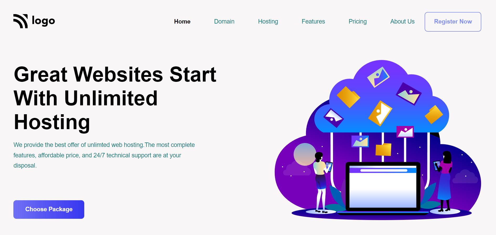
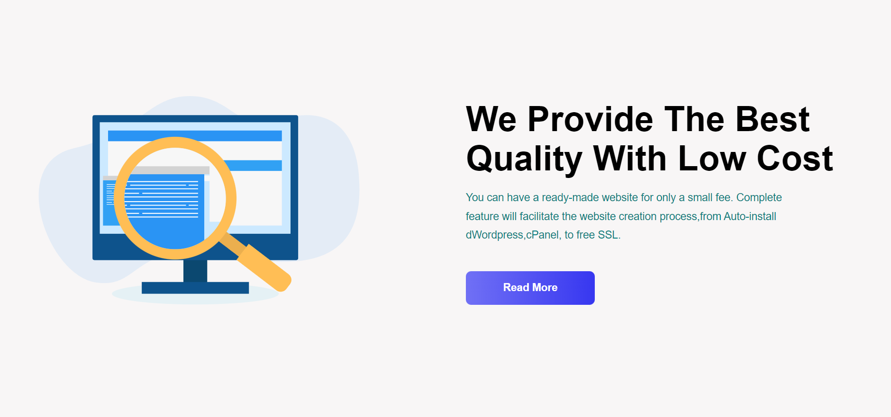
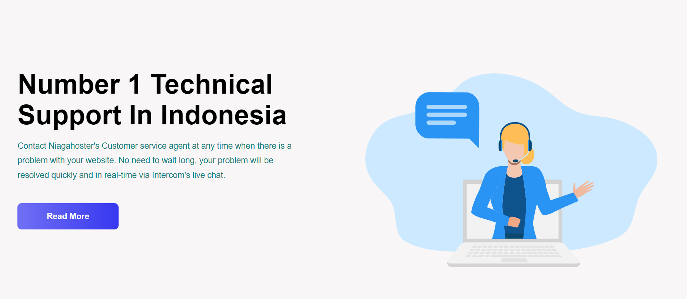
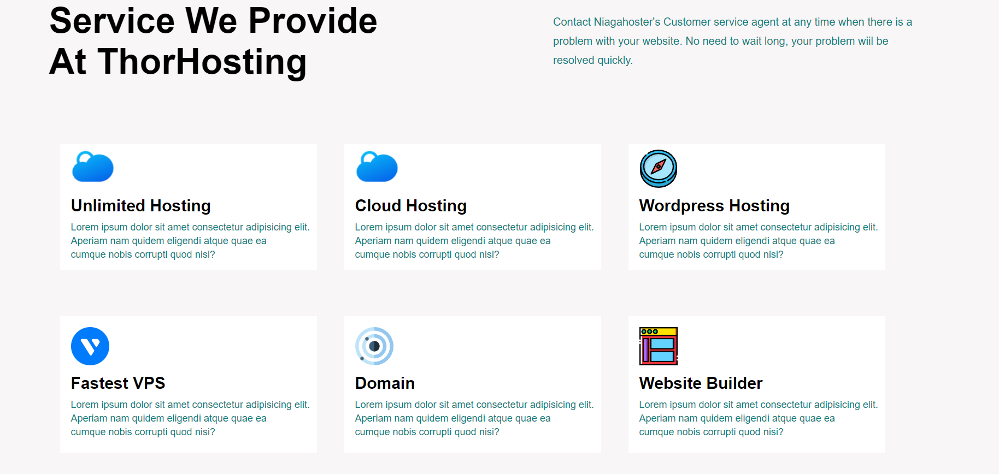
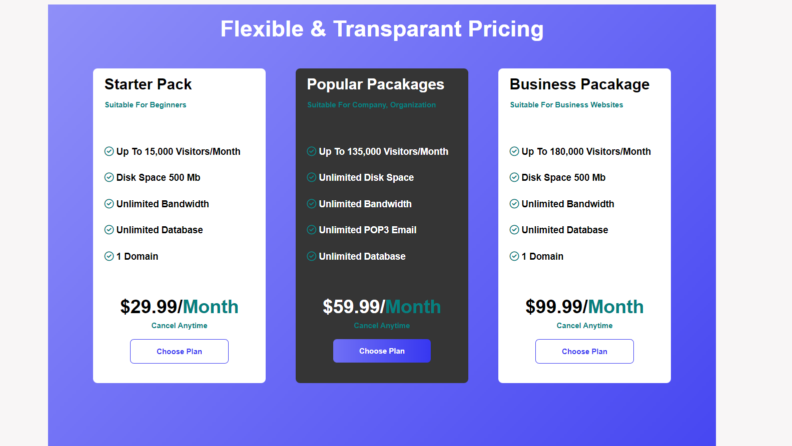
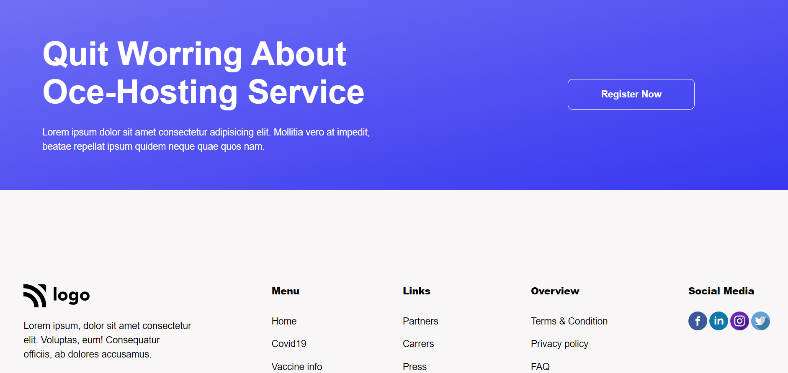

# Web hosting service - [LINK](https://webhosting-11-service.netlify.app/)
 

 

## Skills learnt:
- Learnt more about **Flexbox**
***

## Time taken:
- 6hrs spent on this project
***
## Project screenshots :

